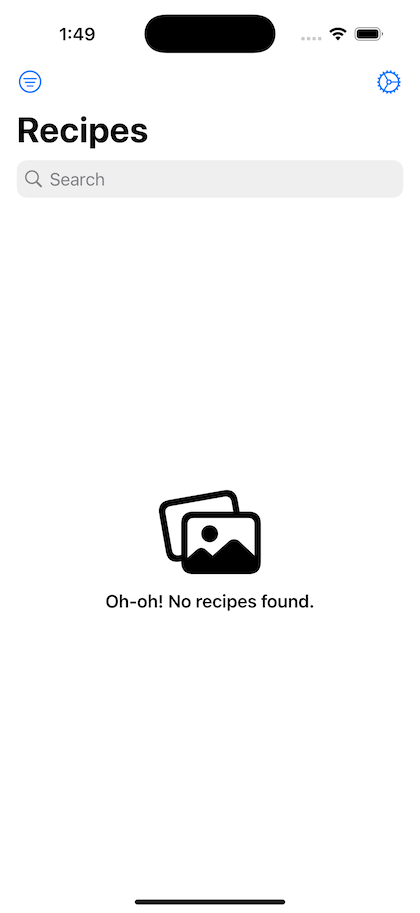
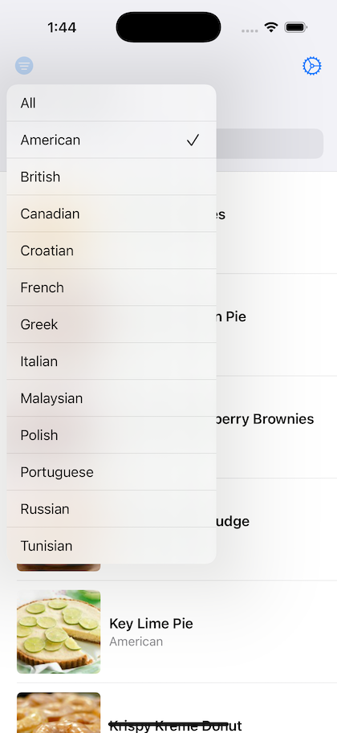

### Summary: Include screen shots or a video of your app highlighting its features

The Recipe app consists of a single screen with a list of recipes. Upon opening the app, it loads a list of recipes. 

### Extra Features

- Tapping on a recipe opens a confirmation dialog that allows you to navigate to a YouTube page or the recipe source if available.

- Filter by cuisine
-- Allows to filter all recipes by a cuisine type
-- When the filter is selected the icon changes to its filled version

- Search by recipe name or cuisine

- The tags on each album cell are scrollable if they are too long and don't fit.

- Settings screen:
-- A modal sheet that allows you to select the app color scheme: light, dark, or automatic/system
-- Haptic feedback when switching between options

- Localization
-- All strings are added to a String Catalog which makes the app localization ready

- Unit tests

- Swift 6

### Focus Areas: What specific areas of the project did you prioritize? Why did you choose to focus on these areas?

I wanted users to have the best experience with the app, so I focused on creating a clean and clear interface. At the same time, I worked on creating clean and maintainable code that can be easily tested and extended later.

### Time Spent: Approximately how long did you spend working on this project? How did you allocate your time?

I spent about 12 hours building this project.
- First I created the networking code and got the data from the server.
- After retrieving the data, I started working on the UI.
- Then I created the image cacher.
- After the main work was done, I spent some time on additional features (filtering, sorting, app theme, and localization)
- After all the work was done, I focused on unit tests.

### Trade-offs and Decisions: Did you make any significant trade-offs in your approach?

The image cache that I created writes files both in-memory and on disk. This approach provides the fastest access to images. While the in-memory cache is managed by NSCache, I have not implemented the logic that clears the cache on disk. This would require more effort and potential discussion on how often the cache should be cleared and how much space can be allocated for it.

### Weakest Part of the Project: What do you think is the weakest part of your project?
Image caching can be improved to clear the cache from disk.

### Additional Information: Is there anything else we should know? Feel free to share any insights or constraints you encountered.

